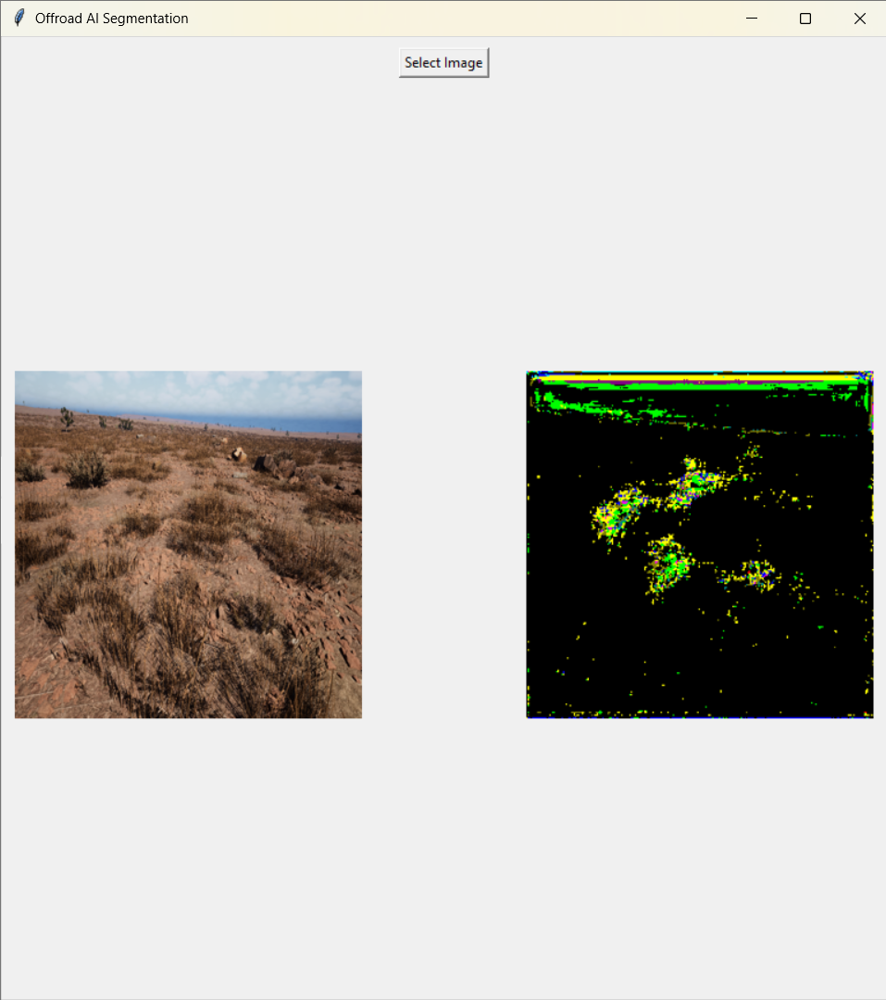

Desert Semantic Segmentation Project

This project focuses on training a semantic segmentation model on a synthetic desert dataset to classify different terrain elements such as trees, rocks, sky, and grass.

A U-Net model with a ResNet34 backbone is used for pixel-wise classification. The input images are resized to 256x256 and normalized before training. The model is trained using PyTorch with CrossEntropy loss and Adam optimizer.

The training process involves loading images and corresponding segmentation masks, learning patterns from the dataset, and saving the trained model as "model.pth". The trained model can then predict segmentation outputs for new images.

A simple GUI is implemented using Tkinter, where users can select an image and view the predicted segmentation result.

The dataset used is a synthetic desert segmentation dataset provided as part of the hackathon. Due to size constraints, the dataset is not included in this repository.

To run the project:
1. Train the model using: py train_model_fast.py
2. Run the GUI using: py gui_model.py

The project successfully generates segmented outputs from input images and demonstrates the application of deep learning in terrain understanding.

Future improvements include increasing IoU score, using better loss functions, applying data augmentation, and deploying the model in real-time systems.

*Input*

*Output* 

